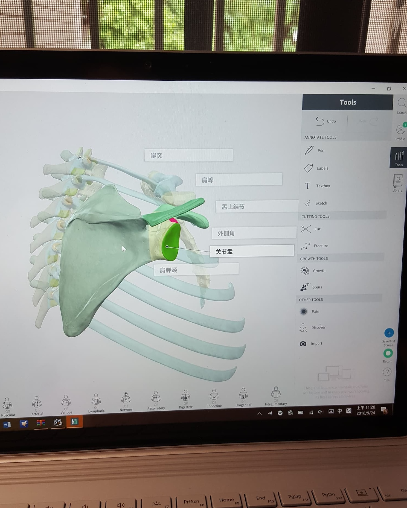
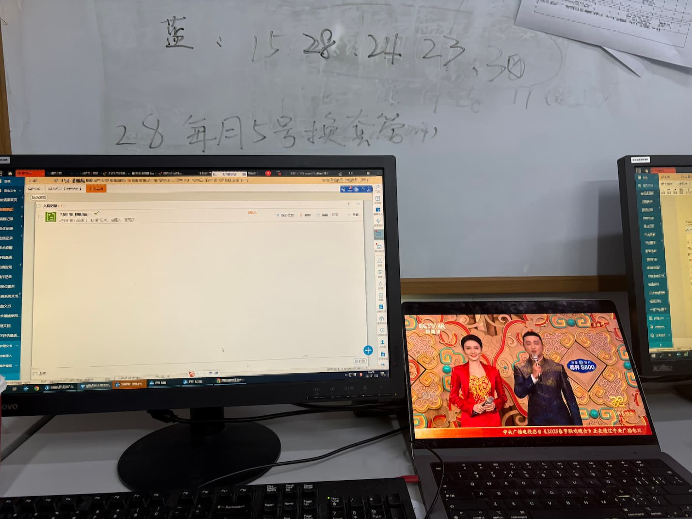
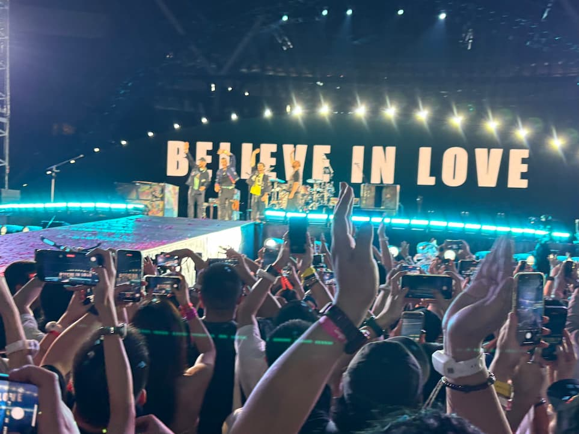

# Reconnecting the Dots: A Journey from Medicine to Open Source

> [!NOTE] TL;DR
>
> After four years of developing Obsidian plugins while navigating demanding medical education system, I experienced burnout from juggling clinical training, research obligations, and open source maintenance. A period of reflection led me to transition into the tech industry, and I'm now resuming active development on Media Extended (v4 beta ready) and ZotLit (major refactoring in progress). Both projects are returning to regular updates with improved architectures and sustainable development approaches.
>
> *[[#Moving Forward A New Chapter|Skip to current updates →]]*

Hello everyone, I'm Aiden. If you've been part of the Obsidian community for a while, you might know me as the developer behind [Media Extended](https://github.com/aidenlx/media-extended), [ZotLit](https://github.com/PKM-er/obsidian-zotlit), and several other plugins that have been downloaded hundreds of thousands of times since 2021. I'm writing today with some good news: after a period of inconsistent updates, both Media Extended and ZotLit are back in active development. Media Extended has undergone a major internal restructure and is ready for v4 beta testing, while ZotLit's refactoring has made significant progress with more updates coming soon.

I owe you an apology for the radio silence and sporadic updates over the past couple of years. If you're interested, I'd like to share the story behind why I stepped away, and more importantly, why I've found my way back to open source development.

## The Beginning: When Code Became My Refuge

My journey into plugin development is inseparable from my background in medicine. China's medical education system is notably complex, featuring multiple pathways ranging from 3 to 8 years, with the standard 5-year Bachelor of Medicine program being the most common route. What many people don't realize is that it typically takes 11 to 14 years for most medical students to complete the full "bachelor-master-doctor" progression in China, combining undergraduate study, standardized residency training (SRT), and often additional specialized training.

As a medical student, my days were filled with memorizing vast amounts of factual knowledge—anatomy, pharmacology, pathology. The medical education system emphasizes extensive theoretical learning followed by clinical rotations, and the sheer volume of information to absorb was overwhelming. Unlike educational systems that encourage critical thinking and creativity, medical school felt like an endless cycle of rote learning and regurgitation.

It was during this period that I discovered Obsidian and, by extension, plugin development. My first foray wasn't actually with Obsidian—it was with MarginNote, an all-in-one study app popular among Chinese students. I built the [AutoDef plugin](https://bbs.marginnote.com.cn/t/topic/8153) for MarginNote 3 to automatically extract and format bilingual medical definitions as aliases from OCR'd textbooks.

When I encountered Obsidian, I faced a practical problem: I wanted to embed course videos directly into my anatomy notes. That simple need sparked the creation of Media Extended. Unlike the passive consumption of medical knowledge I was used to, coding offered something different—each problem was a puzzle to solve, each feature was something I could build and improve.

The early days of Obsidian plugin development were exhilarating. The platform was less mature than it is today, LLMs didn't exist to help with coding, and every solution required digging into hidden APIs, parsing MDN documentation, and learning from error messages. I spent countless hours in Discord channels, discussing technical challenges with Licat (Obsidian's core developer) and other community members. Unlike medical school, the Obsidian ecosystem rewarded creativity and problem-solving.

## The Struggle: When Passion Meets Institutional Reality

As my projects gained traction—Media Extended eventually reaching hundreds of thousands of downloads, ZotLit tens of thousands—the workload began to mount. But the real challenge wasn't technical; it was navigating the competing demands of medical training and open source development.

Chinese medical education can lead to both physical and psychological stress, with students required to complete extensive training in compressed timeframes. As I progressed from undergraduate medical courses to my graduate training phase, which included standardized residency training (SRT), the demands intensified.

During my graduate training, which included standardized residency training, I transitioned from memorizing textbooks to working directly with patients and managing research projects. While patient care provided genuine meaning—I could see the direct impact of my work—the research environment proved challenging. Early in my graduate training, my academic enthusiasm gradually diminished under one of the advisors who would assign various research topics without coherent long-term planning, essentially treating me as a literature review assistant for weekly presentations. To escape this sense of purposelessness, I turned back to what I was good at: I developed ZotLit, using "academic tool development" as justification while actually finding meaning in solving technical challenges.

The laboratory work felt similarly unfulfilling—repetitive tasks with little clear purpose or recognition. Between lengthy meetings and preparation for presentations where the significance of work wasn't always clear, coding became my refuge from these frustrations.

Yet even this refuge began to feel overwhelming as the demands multiplied. Each time I opened GitHub, I was greeted by a growing backlog of notifications that filled me with dread—dozens of issues accumulating without resolution, feature requests from users I genuinely wanted to help but couldn't find time to address, and bug reports that required the kind of deep debugging sessions I simply couldn't squeeze between ward rounds and research obligations. What had once been my escape was slowly becoming another source of stress, though I failed to recognize the signs of burnout at the time.

The only respite came from tackling technical challenges. When I needed to make Media Extended work with arbitrary website webviews, I had proposed a complex solution requiring intricate communication protocols. But through a conversation with Licat, Obsidian's core developer, I discovered something unexpected—an undocumented API that made everything dramatically simpler.

"You have no idea how much time I spent digging into this," he said, sharing his solution. My reaction was pure disbelief at how elegant it was. These were the moments that reminded me why I loved this work—the collaborative breakthroughs, the "aha" moments when complex problems suddenly had simple solutions, the sense that we were building something meaningful together.

But these moments became increasingly rare as my graduate medical training consumed more of my energy. Working night shifts during my residency training, doing ward rounds, writing medical records, and handling emergency situations—while not as intensive as some departments that manage 30+ beds—still left little mental space for creative problem-solving. The irony wasn't lost on me: the very thing that had started as a tool to help my medical studies had become a refuge from them.

The breaking point came last year during a particularly difficult period. After finishing a night shift in ICU and losing a family member—someone I saw one last time but couldn't save despite all my medical training, dealing with the aftermath while exhausted and grieving, I was expected to continue with business as usual—weekly research presentations, clinical duties, administrative tasks. When I missed a research meeting one week later on the weekend, I faced criticism from the mentor who seemed more concerned with attendance than human circumstances. The disconnect between the caring profession I thought I was entering and the institutional reality became impossible to ignore.

## The Turning Point: Connecting the Dots Looking Backwards

Early this year, I had the opportunity to live independently by the ocean while continuing my hospital work, but with relatively lighter workloads. For the first time in years, I had free time alone without roommates to think clearly about my path forward.

I began reviewing the projects I'd built over five years in the open source community, updating my resume, and reflecting on what I'd actually accomplished.

Looking at the numbers—hundreds of thousands of downloads, hundreds of GitHub stars, contributions to major open source projects—I realized that these weren't just side projects. They represented real skills, real impact, and real connections with a global community of developers and users. The technical challenges I'd solved, from WebAssembly integration to complex database optimizations, weren't amateur experiments—they were professional-grade solutions to real problems.

Steve Jobs' famous quote kept coming to mind: "You can't connect the dots looking forward; you can only connect them looking backwards." My medical education had taught me discipline, systems thinking, and how to work under pressure. My clinical experience had shown me the importance of user-centered design and reliable systems. The research work had given me experience with large datasets and complex workflows. Combined with my programming skills, this wasn't a collection of unrelated experiences—it was a unique foundation for building meaningful technology.

The final push came from an unexpected source: a Coldplay concert. Music became another sanctuary during my darkest period, just as coding had once been my refuge from the pressures of medical school. Standing in the general admission area, singing along to "Fix You" during one of my most difficult moments—feeling lost and questioning everything I'd worked toward—the song's promise that "lights will guide you home" felt like exactly what I needed to hear. As thousands of voices joined in "A Sky Full of Stars," the venue erupted with cascading star-shaped confetti raining down on the standing crowd, creating an almost magical atmosphere. In that moment, surrounded by strangers yet feeling deeply connected, with glittering stars falling around us, I experienced the same kind of breakthrough clarity I'd once felt before, but this time, it was about life itself. I felt a sudden understanding that life could take different paths than the one I'd been following.

## Moving Forward: A New Chapter

Despite many people's inability to understand the decision, I made the choice to leave the familiar path of medical training and pursue opportunities in the tech industry. I've joined an AI startup in a new city, stepping into unfamiliar territory but with a clear sense of purpose I hadn't felt in years.

For Media Extended, the transition to a new version represents more than just technical improvements. The plugin has been restructured from the ground up, with plans for a standalone application that will better support media library management. I want to be clear: the shift to a partially closed-source model isn't about data collection or restricting functionality. All core features remain offline-first and local-first, with no login required for basic functionality. The only network connections occur when users explicitly choose online services like AI-powered summaries or Google Drive integration. This approach allows me to explore sustainable development models while maintaining the privacy and user control that the community values.

It's worth noting that v4 includes some changes to website embedding capabilities. The general website player that experienced YouTube loading issues has been deprecated, though YouTube iframe integration remains available for stable playback. Other platforms like Coursera and Bilibili are no longer supported for direct embedding, but we're developing a browser connect feature that will provide an improved solution for these use cases in future updates.

ZotLit's future is equally exciting. I've completed a major refactoring of the database layer using Drizzle ORM, which should make the codebase more maintainable and reduce complexity. The Zotero plugin integration and auto-update mechanisms are being rebuilt to be more reliable. Given the complexity of academic workflows, ZotLit will remain fully open source, and I'm actively encouraging community contributions to help shape its development.

Both projects reflect a more mature approach to open source development—one that balances innovation with sustainability, community needs with maintainer wellbeing.

## Looking Ahead: An Invitation to Connect

If you've made it this far, thank you for taking the time to understand my journey. The Obsidian community has been more than just users of my plugins—you've been collaborators, beta testers, and sources of inspiration during difficult periods. The [PKMer community](https://pkmer.net/en/about/) in particular provided encouragement that helped me persist through challenging times.

[Media Extended v4](https://mx.pkmer.net/docs/v4#v3-user) is ready for beta testing, and I'd love to have community members help refine it before the broader release. For ZotLit users, the upcoming updates should provide more stability and new features while maintaining backward compatibility with existing workflows.

More broadly, I'm excited about the intersection of AI, knowledge management, and personal productivity tools. The next few years promise significant advances in how we interact with information, and I believe the Obsidian ecosystem is uniquely positioned to lead these developments.

If you're interested in contributing to either project, testing new features, or just sharing your own experiences with career transitions in tech, I'd love to hear from you. The beauty of open source development is that it's inherently collaborative—your feedback, bug reports, and feature suggestions don't just improve the software, they create connections between people solving similar problems around the world.

Sometimes the most important dots to connect aren't in your resume or your code repository—they're in the community of people who believe in building better tools together.
